## 基础运行逻辑 ##

在 Aerodrome 中，一个典型的 C++/Python 联合编程环境的结构如图：
<figure markdown="span">
  
</figure>

通常来说，C++ 环境类直接管理 C++ 实体的初始化、运行，并在需要时读取其信息并输出；
Python 环境类则负责处理用户输入、C++ 环境的输出（例如，数据类型的必要转换）等；

当然，这种设计并不是强制的，用户完全可以根据需要自行设计，例如下面两种都是可行的：

<figure markdown="span">
  
  <figcaption>跳过 Python 环境类，直接从 C++ 环境类获取输出</figcaption>
</figure>

<figure markdown="span">
  
  <figcaption>在 Python 中直接实现所有功能</figcaption>
</figure>

# C++ 基础类 #
在 Aerodrome 中，有两个最基本的类型，可以在 `src/simulator/Core` 中找到：

- `BaseEnv`：所有环境的基类，定义了所有环境共有的接口；
- `Object3D`：所有三维对象的基类，定义了三维对象的通用属性，例如速度、位置、姿态等；

!!! info "关于 pybind11 代码实现"
    由于 pybind11 在编译方面的限制，目前 C++ 代码 pybind 绑定的实现方式是将函数/类的定义和实现都写在 `.h` 文件中；pybind 绑定则写在同名的 `.cpp` 文件中。

    如果有更好的实现方式，非常欢迎提出 issue 或 PR！

## BaseEnv ##
在 BaseEnv 中，定义了所有环境共有的接口，包括：

- `reset()`：重置环境；
- `step(action)`：执行一步动作，并返回信息（例如，观测、奖励、终止等）；

<details>
<summary>点击展开代码</summary>

```C++ title="BaseEnv.h"
class BaseEnv
{
public:
    BaseEnv() = default;
    virtual ~BaseEnv() = default;

    virtual py::object reset() = 0;
    virtual py::object step(const py::object& action) = 0;
};
```
</details>

## Object3D ##
Object3D 的内容则较多，包括：

- 位置、速度、姿态等基本属性；
- 将自身属性输出为字典的方法；
- 重置自身属性的方法；
- 计算自身动力学导数的方法；
- 进行一步仿真的方法；

为了准确方便地计算自身的动力学导数并进行仿真，还对运算符进行了重载。
在后面会看到，对于派生类，代码很大程度上是可以复用的，只需要重写少量代码就可以实现一个正确且规范的物理对象。

!!! warning "关于姿态表示"
    Aerodrome 中采用的姿态描述是欧拉角法，会有死锁问题；你也可以自己实现一个旋转矩阵或四元数等其它表示法。

<details>
<summary>点击展开代码</summary>

```C++ title="Object3D.h"
class Object3D {
public:
    std::string name;
    std::string integrator;

    // 位置坐标（地面系）
    std::array<double, 3> pos;

    // 速度向量（地面系）
    std::array<double, 3> vel;

    // 角速度向量（弹体系）
    std::array<double, 3> ang_vel;

    // 转动惯量
    std::array<double, 3> J;

    double V; // 速度

    // 描述刚体姿态的八个角度
    double theta;    // 俯仰角
    double phi;      // 偏航角
    double gamma;    // 倾斜角
    double theta_v;  // 速度倾角
    double phi_v;    // 速度偏角
    double alpha;    // 攻角
    double beta;     // 侧滑角
    double gamma_v;  // 速度倾斜角

    py::dict initial_state;

    Object3D() {}

    Object3D(py::dict input_dict)
    {
        name = input_dict["name"].cast<std::string>();
        integrator = input_dict["integrator"].cast<std::string>();
        pos = input_dict["pos"].cast<std::array<double, 3>>();
        vel = input_dict["vel"].cast<std::array<double, 3>>();
        ang_vel = input_dict["ang_vel"].cast<std::array<double, 3>>();
        J = input_dict["J"].cast<std::array<double, 3>>();
        // V = input_dict["V"].cast<double>();
        V = sqrt(vel[0] * vel[0] + vel[1] * vel[1] + vel[2] * vel[2]);
        theta = input_dict["theta"].cast<double>();
        phi = input_dict["phi"].cast<double>();
        gamma = input_dict["gamma"].cast<double>();
        theta_v = input_dict["theta_v"].cast<double>();
        phi_v = input_dict["phi_v"].cast<double>();
        gamma_v = input_dict["gamma_v"].cast<double>();
        alpha = input_dict["alpha"].cast<double>();
        beta = input_dict["beta"].cast<double>();

        initial_state = input_dict;
    }

    virtual void reset()
    {
        *this = Object3D(initial_state);
    }

    virtual py::dict to_dict()
    {
        py::dict output_dict;
        output_dict["pos"] = pos;
        output_dict["vel"] = vel;
        output_dict["ang_vel"] = ang_vel;
        output_dict["J"] = J;
        output_dict["V"] = V;
        output_dict["theta"] = theta;
        output_dict["phi"] = phi;
        output_dict["gamma"] = gamma;
        output_dict["theta_v"] = theta_v;
        output_dict["phi_v"] = phi_v;
        output_dict["alpha"] = alpha;
        output_dict["beta"] = beta;
        output_dict["gamma_v"] = gamma_v;
        output_dict["name"] = name;
        return output_dict;
    }

    virtual py::object step(py::dict action)
    {
        double dt = action["dt"].cast<double>();
        
        pos = action["pos"].cast<std::array<double, 3>>();
        vel = action["vel"].cast<std::array<double, 3>>();
        ang_vel = action["ang_vel"].cast<std::array<double, 3>>();
        J = action["J"].cast<std::array<double, 3>>();
        // V = action["V"].cast<double>();
        V = sqrt(vel[0] * vel[0] + vel[1] * vel[1] + vel[2] * vel[2]);
        theta = action["theta"].cast<double>();
        phi = action["phi"].cast<double>();
        gamma = action["gamma"].cast<double>();
        theta_v = action["theta_v"].cast<double>();
        phi_v = action["phi_v"].cast<double>();
        gamma_v = action["gamma_v"].cast<double>();
        alpha = action["alpha"].cast<double>();
        beta = action["beta"].cast<double>();

        if (integrator == "euler")
        {
            *this = *this + this->d() * dt;
        }
        else if (integrator == "midpoint")
        {
            auto temp1 = *this + this->d() * (0.5 * dt);
            auto k1 = temp1.d();
            *this = *this + k1 * dt;
        }
        else if (integrator == "rk23")
        {
            auto k1 = this->d();
            auto temp1 = *this + k1 * (0.5 * dt);
            auto k2 = temp1.d();
            auto temp2 = *this + k2 * (0.5 * dt);
            auto k3 = temp2.d();
            *this = *this + (k1 + k2 * 2 + k3) * (dt / 4);
        }
        else if (integrator == "rk45")
        {
            auto k1 = this->d();
            auto temp1 = *this + k1 * (0.5 * dt);
            auto k2 = temp1.d();
            auto temp2 = *this + k2 * (0.5 * dt);
            auto k3 = temp2.d();
            auto temp3 = *this + k3 * dt;
            auto k4 = temp3.d();
            *this = *this + (k1 + k2 * 2 + k3 * 2 + k4) * (dt / 6);
        }

        theta_v = atan2(vel[1], sqrt(vel[0] * vel[0] + vel[2] * vel[2]));
        phi_v = atan2(-vel[2], vel[0]);
        
        beta = cos(theta_v) * (cos(gamma) * sin(phi - phi_v) + sin(theta) * sin(gamma) * cos(phi - phi_v)) - sin(theta_v) * cos(theta) * sin(gamma);
        alpha = (cos(theta_v) * (sin(theta) * cos(gamma) * cos(phi - phi_v) - sin(gamma) * sin(phi - phi_v)) - sin(theta_v) * cos(theta) * cos(gamma)) / cos(beta);
        gamma_v = (cos(alpha) * sin(beta) * sin(theta) - sin(alpha) * sin(beta) * cos(gamma) * cos(theta) + cos(beta) * sin(gamma) * cos(theta)) / cos(theta_v);

        V = sqrt(vel[0] * vel[0] + vel[1] * vel[1] + vel[2] * vel[2]);
        return to_dict();
    }

    virtual Object3D d()
    {
        auto derivative = *this;

        derivative.pos[0] = vel[0];
        derivative.pos[1] = vel[1];
        derivative.pos[2] = vel[2];

        derivative.vel[0] = 0;
        derivative.vel[1] = 0;
        derivative.vel[2] = 0;

        derivative.ang_vel[0] = 0;
        derivative.ang_vel[1] = 0;
        derivative.ang_vel[2] = 0;

        derivative.theta = ang_vel[1] * sin(gamma) + ang_vel[2] * cos(gamma);
        derivative.phi = (ang_vel[1] * cos(gamma) - ang_vel[2] * sin(gamma)) / cos(theta);
        derivative.gamma = ang_vel[0] * - tan(theta) * (ang_vel[1] * cos(gamma) - ang_vel[2] * sin(gamma));

        derivative.theta_v = 0;
        derivative.phi_v = 0;
        derivative.gamma_v = 0;

        derivative.alpha = 0;
        derivative.beta = 0;

        return derivative;
    }
    
    template<typename T, typename P>
    friend T operator+(const T& lop, const P& rop)
    {
        auto result = lop;

        for (int i = 0; i < 3; ++i)
        {   
            result.pos[i] = lop.pos[i] + rop.pos[i];
            result.vel[i] = lop.vel[i] + rop.vel[i];
            result.ang_vel[i] = lop.ang_vel[i] + rop.ang_vel[i];
        }   

        result.V = lop.V + rop.V;
        result.theta = lop.theta + rop.theta;
        result.phi = lop.phi + rop.phi;
        result.gamma = lop.gamma + rop.gamma;
        result.theta_v = lop.theta_v + rop.theta_v;
        result.phi_v = lop.phi_v + rop.phi_v; 
        result.alpha = lop.alpha + rop.alpha;
        result.beta = lop.beta + rop.beta;
        result.gamma_v = lop.gamma_v + rop.gamma_v;

        return result;
    }

    template<typename T, typename P>
    friend T operator-(const T& lop, const P& rop)
    {
        auto result = lop;

        for (int i = 0; i < 3; ++i)
        {
            result.pos[i] = lop.pos[i] - rop.pos[i];
            result.vel[i] = lop.vel[i] - rop.vel[i];
            result.ang_vel[i] = lop.ang_vel[i] - rop.ang_vel[i];
        }

        result.V = lop.V - rop.V;
        result.theta = lop.theta - rop.theta;
        result.phi = lop.phi - rop.phi;
        result.gamma = lop.gamma - rop.gamma;
        result.theta_v = lop.theta_v - rop.theta_v;
        result.phi_v = lop.phi_v - rop.phi_v;
        result.alpha = lop.alpha - rop.alpha;
        result.beta = lop.beta - rop.beta;
        result.gamma_v = lop.gamma_v - rop.gamma_v;

        return result;
    }

    template<typename T>
    friend T operator*(const T& lop, const double& rop)
    {
        auto result = lop;

        for (int i = 0; i < 3; ++i)
        {
            result.pos[i] = lop.pos[i] * rop; 
            result.vel[i] = lop.vel[i] * rop;
            result.ang_vel[i] = lop.ang_vel[i] * rop;
        }   

        result.V = lop.V * rop;
        result.theta = lop.theta * rop;
        result.phi = lop.phi * rop;
        result.gamma = lop.gamma * rop;
        result.theta_v = lop.theta_v * rop;
        result.phi_v = lop.phi_v * rop;
        result.alpha = lop.alpha * rop;
        result.beta = lop.beta * rop;
        result.gamma_v = lop.gamma_v * rop;

        return result;
    }
    
    template<typename T>
    friend T operator/(const T& lop, const double& rop)
    {
        auto result = lop;

        for (int i = 0; i < 3; ++i)
        {
            result.pos[i] = lop.pos[i] / rop; 
            result.vel[i] = lop.vel[i] / rop;
            result.ang_vel[i] = lop.ang_vel[i] / rop;
        }   

        result.V = lop.V / rop;
        result.theta = lop.theta / rop;
        result.phi = lop.phi / rop;
        result.gamma = lop.gamma / rop;
        result.theta_v = lop.theta_v / rop;
        result.phi_v = lop.phi_v / rop;   
        result.alpha = lop.alpha / rop;
        result.beta = lop.beta / rop;
        result.gamma_v = lop.gamma_v / rop;

        return result;
    }
};
```
</details>