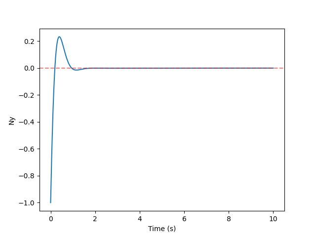

# 纵向过载控制 - 经典控制 #

在 Aerodrome 中提供了一个飞行器纵向过载控制的示例项目。被控对象为 Winged-Cone，其气动模型参考自公开数据。项目中分别采用传统三回路驾驶仪和强化学习算法（连续动作PPO）进行过载控制器设计，以展示传统控制算法以及强化学习算法训练部署的基本流程和实现。

使用到的代码：

- WingedCone2D： `src/simulator/CanonicalAircraftEnv/objects/WingedCone2D.h`
- WingedCone2D - Classic： `src/simulator/CanonicalAircraftEnv/objects/WingedCone2D_Classic.h`
- Python 中调用 WingedCone2d - Classic 进行计算：`examples/AircraftControl/WingedCone_Classic.py`

## WingedCone2D ##

`WingedCone2D` 实现为 `Aircraft3D` 的子类，"`2D`" 表示其气动模型只实现了纵向的部分。

相对于 `Aircraft3D`，`WingedCone2D` 增加了升降舵偏角 `delta_e` 属性，并复写了 `Aircraft3D` 的 `step()` 方法，在其中增加了计算气动力的部分。相应地，气动力（`L`，`D`，`T`，`M`）的计算被实现为单独的函数（`_L()`，`_D()`，`_T()`，`_M()`）。输入动作直接对 `delta_e` 进行修改。

<details>
<summary>点击展开代码</summary>

```cpp title="WingedCone2D.h"
class WingedCone2D : public Aircraft3D
{
public:
    double delta_e; // 升降舵偏角

    WingedCone2D() {}
    
    WingedCone2D(py::dict input_dict) : Aircraft3D(input_dict)
    {
        delta_e = 0.0;        
    }

    virtual void reset() override
    {
        *this = WingedCone2D(initial_state);
    }

    void _D()
    {
        double CD = 0.645 * alpha * alpha + 0.0043378 * alpha + 0.003772;
        D = q * S * CD;
    }

    void _L()
    {
        double CL = 0.6203 * alpha + 2.4 * sin(0.08 * alpha);
        L = q * S * CL;
    }

    virtual void _T()
    {
        T = 4.959e3;
    }

    void _M()
    {
        double CM1 = -0.035 * alpha * alpha + 0.036617 * alpha + 5.3261e-6;
        double CM2 = ang_vel[2] * c * (-6.796 * alpha * alpha + 0.3015 * alpha - 0.2289) / (2 * V);
        double CM3 = 0.0292 * (delta_e - alpha);
        M[2] = q * S * c * (CM1 + CM2 + CM3);
    }

    virtual py::dict to_dict() override
    {
        py::dict output_dict = Aircraft3D::to_dict();
        output_dict["delta_e"] = delta_e;
        return output_dict;
    }

    virtual py::object step(py::dict action) override
    {
        double dt = action["dt"].cast<double>();

        delta_e = action["delta_e"].cast<double>(); // 传入动作直接修改 delta_e
        
        // 新增计算气动力的部分
        _D();
        _L();
        _T();
        _M();

        if (integrator == "euler")
        {
            *this = *this + this->d() * dt;
        }
        else if (integrator == "midpoint")
        {
            auto temp1 = *this + this->d() * (0.5 * dt);
            auto k1 = temp1.d();
            *this = *this + k1 * dt;
        }
        else if (integrator == "rk23")
        {
            auto k1 = this->d();
            auto temp1 = *this + k1 * (0.5 * dt);
            auto k2 = temp1.d();
            auto temp2 = *this + k2 * (0.5 * dt);
            auto k3 = temp2.d();
            *this = *this + (k1 + k2 * 2 + k3) * (dt / 4);
        }
        else if (integrator == "rk45")
        {
            auto k1 = this->d();
            auto temp1 = *this + k1 * (0.5 * dt);
            auto k2 = temp1.d();
            auto temp2 = *this + k2 * (0.5 * dt);
            auto k3 = temp2.d();
            auto temp3 = *this + k3 * dt;
            auto k4 = temp3.d();
            *this = *this + (k1 + k2 * 2 + k3 * 2 + k4) * (dt / 6);
        }

        beta = cos(theta_v) * (cos(gamma) * sin(phi - phi_v) + sin(theta) * sin(gamma) * cos(phi - phi_v)) - sin(theta_v) * cos(theta) * sin(gamma);
        alpha = (cos(theta_v) * (sin(theta) * cos(gamma) * cos(phi - phi_v) - sin(gamma) * sin(phi - phi_v)) - sin(theta_v) * cos(theta) * cos(gamma)) / cos(beta);
        gamma_v = (cos(alpha) * sin(beta) * sin(theta) - sin(alpha) * sin(beta) * cos(gamma) * cos(theta) + cos(beta) * sin(gamma) * cos(theta)) / cos(theta_v);

        vel[0] = V * cos(theta_v) * cos(phi_v);
        vel[1] = V * sin(theta_v);
        vel[2] = -V * cos(theta_v) * sin(phi_v);
        h = pos[1];

        Tem = Temperature(h);
        Pres = Pressure(h);
        Rho = Density(Tem, Pres);
        a = SpeedofSound(Tem);
        g = Gravity(h);

        q = 0.5 * Rho * V * V;
        return to_dict();
    }
};

```

</details>

## WingedCone2D - Classic ##

`WingedCone2D_Classic` 类是 `WingedCone2D` 的子类，提供了纵向过载控制的传统三回路驾驶仪实现。

具体地，`WingedCone2D_Classic` 增加了若干控制参数（例如，`Kiz`，`Kwz` 等），控制器所需要的数值（例如，过载跟踪误差 `eNy` 及其积分项 `i_eNy` 等）；传入动作为过载指令，舵偏角不再由动作控制，而是由控制器计算；`step()` 方法中新增由控制器计算舵偏的部分。

!!! warning ""
    虽然传入动作中有速度指令 `Vc`，并且有由速度指令控制发动机开度的函数 `V_controller()`，但出于简易起见最终并未实装（即，推力 `T` 不受控制器影响，为固定值 `T = 4.959e3`）。

<details>
<summary>点击展开代码</summary>

```cpp title="WingedCone2D_Classic.h"
class WingedCone2D_Classic : public WingedCone2D
{
public:
    // 俯仰角增稳过载驾驶仪控制参数
    double Kiz;   // 积分增益
    double Kwz;   // 角速度增益
    double Kaz;   // 增稳回路增益
    double Kpz;   // 比例增益

    double eNy; // 过载跟踪误差
    double i_eNy; // 过载积分项
    double p_eNy; // 过载比例项

    double i_eSAC; // 增稳回路积分项

    double Kp_V, Ki_V, Kd_V; // 速度控制参数

    double i_V; // 速度积分项
    double d_eV; // 速度微分项
    double eV_prev; // 速度误差前值

    double Ny; // 当前过载
    double wz; // 当前滚转角速度
    
    WingedCone2D_Classic() {}
    
    WingedCone2D_Classic(py::dict input_dict) : WingedCone2D(input_dict)
    {
        Kiz = input_dict["Kiz"].cast<double>();
        Kwz = input_dict["Kwz"].cast<double>();
        Kaz = input_dict["Kaz"].cast<double>();
        Kpz = input_dict["Kpz"].cast<double>();

        Kp_V = input_dict["Kp_V"].cast<double>();
        Ki_V = input_dict["Ki_V"].cast<double>();
        Kd_V = input_dict["Kd_V"].cast<double>();

        eNy = 0;
        i_eNy = 0;
        p_eNy = 0;
        i_eSAC = 0;
        i_V = 0;
        d_eV = 0;
        eV_prev = 0;

        _D();
        _L();
        _T();
        _M();

        Ny = (T * (sin(alpha) * cos(gamma_v) - cos(alpha) * sin(beta) * sin(gamma_v))
                                + L * cos(gamma_v) - N * sin(gamma_v) - m * g * cos(theta_v)) / (m * g);
        wz = ang_vel[2];
    }

    virtual void reset() override
    {
        *this = WingedCone2D_Classic(initial_state);
    }

    double V_controller(double Vc, double V, double dt)
    {
        // 速度跟踪误差
        double eV = Vc - V;
        i_V += eV * dt;
        d_eV = (eV - eV_prev) / dt;
        eV_prev = eV;

        double u1a = Kp_V * eV + Ki_V * i_V + Kd_V * d_eV;
        if (u1a < 0) 
        {
            u1a = 0;
        }

        return u1a;
    }

    double Ny_controller(double Nyc, double Ny, double wz, double dt)
    {
        // 过载跟踪误差
        eNy = Nyc - Ny;

        // PI校正环节
        i_eNy += eNy * dt;
        p_eNy = eNy;

        double pi_eNy = Kiz * i_eNy + Kpz * p_eNy;

        // 增稳回路
        double eSAC = pi_eNy - Kaz * wz;
        i_eSAC += eSAC * dt;

        // 阻尼回路
        double eDamp = i_eSAC - Kwz * wz;

        return eDamp;
    }

    virtual py::dict to_dict() override
    {
        py::dict output_dict = WingedCone2D::to_dict();
        output_dict["Ny"] = Ny;
        return output_dict;
    }

    virtual py::object step(py::dict action) override
    {
        double dt = action["dt"].cast<double>();

        double Nyc = action["Nyc"].cast<double>();
        double Vc = action["Vc"].cast<double>();

        delta_e = Ny_controller(Nyc, Ny, wz, dt*0.1);
        delta_e = std::clamp(delta_e, -25 / 57.3, 25 / 57.3);

        double Phi = V_controller(Vc, V, dt*0.1);

        // 计算气动力
        _D();
        _L();
        _T();
        _M();

        if (integrator == "euler")
        {
            *this = *this + this->d() * dt;
        }
        else if (integrator == "midpoint")
        {
            auto temp1 = *this + this->d() * (0.5 * dt);
            auto k1 = temp1.d();
            *this = *this + k1 * dt;
        }
        else if (integrator == "rk23")
        {
            auto k1 = this->d();
            auto temp1 = *this + k1 * (0.5 * dt);
            auto k2 = temp1.d();
            auto temp2 = *this + k2 * (0.5 * dt);
            auto k3 = temp2.d();
            *this = *this + (k1 + k2 * 2 + k3) * (dt / 4);
        }
        else if (integrator == "rk45")
        {
            auto k1 = this->d();
            auto temp1 = *this + k1 * (0.5 * dt);
            auto k2 = temp1.d();
            auto temp2 = *this + k2 * (0.5 * dt);
            auto k3 = temp2.d();
            auto temp3 = *this + k3 * dt;
            auto k4 = temp3.d();
            *this = *this + (k1 + k2 * 2 + k3 * 2 + k4) * (dt / 6);
        }

        beta = cos(theta_v) * (cos(gamma) * sin(phi - phi_v) + sin(theta) * sin(gamma) * cos(phi - phi_v)) - sin(theta_v) * cos(theta) * sin(gamma);
        alpha = (cos(theta_v) * (sin(theta) * cos(gamma) * cos(phi - phi_v) - sin(gamma) * sin(phi - phi_v)) - sin(theta_v) * cos(theta) * cos(gamma)) / cos(beta);
        gamma_v = (cos(alpha) * sin(beta) * sin(theta) - sin(alpha) * sin(beta) * cos(gamma) * cos(theta) + cos(beta) * sin(gamma) * cos(theta)) / cos(theta_v);

        vel[0] = V * cos(theta_v) * cos(phi_v);
        vel[1] = V * sin(theta_v);
        vel[2] = -V * cos(theta_v) * sin(phi_v);
        h = pos[1];

        Tem = Temperature(h);
        Pres = Pressure(h);
        Rho = Density(Tem, Pres);
        a = SpeedofSound(Tem);
        g = Gravity(h);

        q = 0.5 * Rho * V * V;

        Ny = (T * (sin(alpha) * cos(gamma_v) - cos(alpha) * sin(beta) * sin(gamma_v))
                                + L * cos(gamma_v) - N * sin(gamma_v) - m * g * cos(theta_v)) / (m * g);
        wz = ang_vel[2];

        return to_dict();
    }
};

```

</details>

## Python 代码 ##

由于 `WingedCone2D_Classic` 的控制代码直接在 C++ 类中实现，因此 Python 部分代码较少，而且 **直接调用 C++ 类，没有经过 Python 包装** （也就是 `基础逻辑和类` 章节中介绍的第二种设计模式），只有 C++ 环境调用、步进循环和绘图部分。这也是第一个涉及 `Space3D` 类使用的示例。

```py title="WingedCone_Classic.py"
# 直接从编译好的 C++ 模块中取出 WingedCone2D_Classic 和 Space3D 类使用，不经过 Python
from aerodrome.simulator.CanonicalAircraftEnv.objects.WingedCone2D_Classic import WingedCone2D_Classic
from aerodrome.simulator.Core.envs.Space3D import Space3D
from math import *

if __name__ == "__main__":
    dt = 0.001 # 定义步进步长，这里设置为固定值 0.001
    # 实例化 Space3D 类，第二个实参表示步进步长，第三个实参表示每次步进分成的积分次数
    env = Space3D(dt, 0.001, 1) 

    # 定义仿真对象的参数字典，用于生成对象
    object_dict = {
        "name": "test",
        "integrator": "rk45",
        "S": 3603.0,
        "c": 80.0,
        "m": 9375.0,

        "pos": [0.0, 33528.0, 0.0],
        "vel": [4590.29, 0.0, 0.0],
        "ang_vel": [0.0, 0.0, 0.0],
        "J": [1.0, 7*10**6, 7*10**6],
        "theta": 0.00/180*pi,
        "phi": 0.0,
        "gamma": 0.0,   
        "theta_v": 0.0,
        "phi_v": 0.0,
        "gamma_v": 0.0,
        "alpha": 0.00/180*pi,
        "beta": 0.0,

        "Kiz": 0.2597,
        "Kwz": 1.6,
        "Kaz": 13/2,
        "Kpz": 0.14,
        "Kp_V": 5.0,
        "Ki_V": 1.0,
        "Kd_V": 0.3
    }

    object = WingedCone2D_Classic(object_dict) # 从字典生成对象
    env.add_object(object) # 将对象添加到环境中

    # 用于保存数据的数组
    import numpy as np

    cnt = 10000
    x = np.arange(cnt) * dt
    y = np.zeros(cnt)

    Nyc = 0.0 # 过载指令
    Vc = 3000 # 速度指令

    for i in range(cnt):
        action = {"test": {"Nyc":Nyc, "Vc":Vc}} # 定义动作
        result = env.step(action) # 步进并接受返回值
        y[i] = result["test"]["Ny"] # 从返回的字典中提取需要的值

    # 绘图
    import matplotlib.pyplot as plt
    plt.plot(x, y)
    plt.xlabel("Time (s)")
    plt.ylabel("Ny")
    plt.axhline(y=Nyc, color='r', linestyle='--', alpha=0.5)
    plt.show()

    print(env.to_dict())
```

代码运行结果：

<figure markdown="span">
  
  <figcaption>过载响应曲线</figcaption>
</figure>