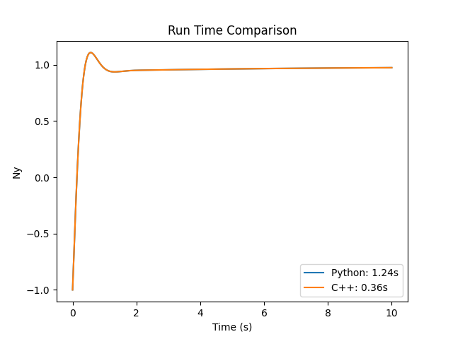

# 纵向过载控制 - 经典控制（纯 Python 实现） #

本章与上一章实现的功能完全相同，但将 C++ 部分代码完全迁移至 Python，并进行了性能比较。

```py title="WingedCone_py.py"
import numpy as np
from math import pi
from aerodrome.registration import register

TABLE4 = [
    [00000, -0.0065, 288.150, 1.01325000000000E+5],
    [11000, 0.0000, 216.650, 2.26320639734629E+4],
    [20000, 0.0010, 216.650, 5.47488866967777E+3],
    [32000, 0.0028, 228.650, 8.68018684755228E+2],
    [47000, 0.0000, 270.650, 1.10906305554966E+2],
    [51000, -0.0028, 270.650, 6.69388731186873E+1],
    [71000, -0.0020, 214.650, 3.95642042804073E+0],
    [84852, 0.0000, 186.946, 3.73383589976215E-1]
] # 空气参数表，参考 y_atmosphere.h

def Temperature(z):
    H = z * 6356766 / (z + 6356766)
    for b in range(7):
        if H < TABLE4[b+1][0]:
            break
    return TABLE4[b][2] + TABLE4[b][1] * (H - TABLE4[b][0])

def Pressure(z):
    H = z * 6356766 / (z + 6356766)
    for b in range(7):
        if H < TABLE4[b+1][0]:
            break
    C = -0.0341631947363104
    Hb = TABLE4[b][0]
    Lb = TABLE4[b][1]
    Tb = TABLE4[b][2]
    Pb = TABLE4[b][3]
    if abs(Lb) > 1E-12:
        return Pb * pow(1 + Lb/Tb * (H-Hb), C/Lb)
    else:
        return Pb * np.exp(C * (H-Hb)/Tb)

def Density(T, P):
    return P * 0.00348367635597379 / T

def SpeedofSound(T):
    return np.sqrt(401.87430086589 * T)

def Gravity(z):
    return 9.80665 * pow(1 + z/6356766, -2)

class WingedCone_py:
    def __init__(self, input_dict):
        # Object3D
        self.name = input_dict["name"]
        self.integrator = input_dict["integrator"]
        self.dt = input_dict["dt"]

        self.init_m = self.m = input_dict["m"]
        self.d_m = 0
        self.J = np.array(input_dict["J"]).reshape(3, 3)
        self.J_inv = np.linalg.inv(self.J)

        self.init_pos = self.pos = np.array(input_dict["pos"])
        self.init_vel = self.vel = np.array(input_dict["vel"])
        self.init_ang_vel = self.ang_vel = np.array(input_dict["ang_vel"])
        self.init_V = self.V = np.sqrt(self.vel[0] * self.vel[0] + self.vel[1] * self.vel[1] + self.vel[2] * self.vel[2])
        self.init_theta = self.theta = input_dict["theta"]
        self.init_phi = self.phi = input_dict["phi"]
        self.init_gamma = self.gamma = input_dict["gamma"]
        self.init_theta_v = self.theta_v = input_dict["theta_v"]
        self.init_phi_v = self.phi_v = input_dict["phi_v"]

        self.beta = np.asin(np.cos(self.theta_v) * (np.cos(self.gamma) * np.sin(self.phi - self.phi_v) + np.sin(self.theta) * np.sin(self.gamma) * np.cos(self.phi - self.phi_v)) - np.sin(self.theta_v) * np.cos(self.theta) * np.sin(self.gamma))
        self.alpha = np.asin((np.cos(self.theta_v) * (np.sin(self.theta) * np.cos(self.gamma) * np.cos(self.phi - self.phi_v) - np.sin(self.gamma) * np.sin(self.phi - self.phi_v)) - np.sin(self.theta_v) * np.cos(self.theta) * np.cos(self.gamma)) / np.cos(self.beta))
        self.gamma_v = np.asin((np.cos(self.alpha) * np.sin(self.beta) * np.sin(self.theta) - np.sin(self.alpha) * np.sin(self.beta) * np.cos(self.gamma) * np.cos(self.theta) + np.cos(self.beta) * np.sin(self.gamma) * np.cos(self.theta)) / np.cos(self.theta_v))

        # Aircraft3D
        self.h = self.pos[1]
        self.S = input_dict["S"]
        self.c = input_dict["c"]

        self.Tem = Temperature(self.h)
        self.Pres = Pressure(self.h)
        self.Rho = Density(self.Tem, self.Pres)
        self.a = SpeedofSound(self.Tem)
        self.g = Gravity(self.h)
        
        self.q = 0.5 * self.Rho * self.V * self.V

        self.L = 0.0
        self.D = 0.0
        self.N = 0.0
        self.T = 0.0
        self.M = [0.0, 0.0, 0.0]

        # WingedCone2D
        self.delta_e = 0.0

        # WingedCone2D_Classic
        self.Kiz = input_dict["Kiz"]
        self.Kwz = input_dict["Kwz"]
        self.Kaz = input_dict["Kaz"]
        self.Kpz = input_dict["Kpz"]

        self.Kp_V = input_dict["Kp_V"]
        self.Ki_V = input_dict["Ki_V"]
        self.Kd_V = input_dict["Kd_V"]

        self.eNy = 0.0
        self.i_eNy = 0.0
        self.p_eNy = 0.0
        self.i_eSAC = 0.0
        self.i_V = 0.0
        self.d_eV = 0.0
        self.eV_prev = 0.0

        self._D()
        self._L()
        self._T()
        self._M()

        self.Ny = (self.T * (np.sin(self.alpha) * np.cos(self.gamma_v) - np.cos(self.alpha) * np.sin(self.beta) * np.sin(self.gamma_v))
                                + self.L * np.cos(self.gamma_v) - self.N * np.sin(self.gamma_v) - self.m * self.g * np.cos(self.theta_v)) / (self.m * self.g)
        self.wz = self.ang_vel[2]

    def reset(self):
        self.pos = self.init_pos.copy()
        self.vel = self.init_vel.copy()
        self.ang_vel = self.init_ang_vel.copy()
        self.m = self.init_m

        self.V = self.init_V
        self.theta = self.init_theta
        self.phi = self.init_phi
        self.gamma = self.init_gamma
        self.theta_v = self.init_theta_v
        self.phi_v = self.init_phi_v

        self.beta = np.asin(np.cos(self.theta_v) * (np.cos(self.gamma) * np.sin(self.phi - self.phi_v) + np.sin(self.theta) * np.sin(self.gamma) * np.cos(self.phi - self.phi_v)) - np.sin(self.theta_v) * np.cos(self.theta) * np.sin(self.gamma))
        self.alpha = np.asin((np.cos(self.theta_v) * (np.sin(self.theta) * np.cos(self.gamma) * np.cos(self.phi - self.phi_v) - np.sin(self.gamma) * np.sin(self.phi - self.phi_v)) - np.sin(self.theta_v) * np.cos(self.theta) * np.cos(self.gamma)) / np.cos(self.beta))
        self.gamma_v = np.asin((np.cos(self.alpha) * np.sin(self.beta) * np.sin(self.theta) - np.sin(self.alpha) * np.sin(self.beta) * np.cos(self.gamma) * np.cos(self.theta) + np.cos(self.beta) * np.sin(self.gamma) * np.cos(self.theta)) / np.cos(self.theta_v))

        self.h = self.pos[1]

        self.Tem = Temperature(self.h)
        self.Pres = Pressure(self.h)
        self.Rho = Density(self.Tem, self.Pres)
        self.a = SpeedofSound(self.Tem)
        self.g = Gravity(self.h)

        self.q = 0.5 * self.Rho * self.V * self.V

        self.L = 0.0
        self.D = 0.0
        self.N = 0.0
        self.T = 0.0
        self.M = [0.0, 0.0, 0.0]

        self.delta_e = 0.0

        self.eNy = 0.0
        self.i_eNy = 0.0
        self.p_eNy = 0.0
        self.i_eSAC = 0.0
        self.i_V = 0.0
        self.d_eV = 0.0
        self.eV_prev = 0.0

        self._D()
        self._L()
        self._T()
        self._M()

        self.Ny = (self.T * (np.sin(self.alpha) * np.cos(self.gamma_v) - np.cos(self.alpha) * np.sin(self.beta) * np.sin(self.gamma_v))
                                + self.L * np.cos(self.gamma_v) - self.N * np.sin(self.gamma_v) - self.m * self.g * np.cos(self.theta_v)) / (self.m * self.g)
        self.wz = self.ang_vel[2]

    def _D(self):
        CD = 0.645 * self.alpha * self.alpha + 0.0043378 * self.alpha + 0.003772
        self.D = self.q * self.S * CD

    def _L(self):
        CL = 0.6203 * self.alpha + 2.4 * np.sin(0.08 * self.alpha)
        self.L = self.q * self.S * CL

    def _T(self):
        self.T = 4.959e3

    def _M(self):
        CM1 = -0.035 * self.alpha * self.alpha + 0.036617 * self.alpha + 5.3261e-6
        CM2 = self.ang_vel[2] * self.c * (-6.796 * self.alpha * self.alpha + 0.3015 * self.alpha - 0.2289) / (2 * self.V)
        CM3 = 0.0292 * (self.delta_e - self.alpha)
        self.M[2] = self.q * self.S * self.c * (CM1 + CM2 + CM3)
    
    def to_dict(self):
        return {
            # Object3D
            "name": self.name,
            "integrator": self.integrator,
            "dt": self.dt,
            "pos": self.pos,
            "vel": self.vel,
            "ang_vel": self.ang_vel,
            "J": self.J,
            "J_inv": self.J_inv,
            "V": np.sqrt(self.vel[0] * self.vel[0] + self.vel[1] * self.vel[1] + self.vel[2] * self.vel[2]),
            "theta": self.theta,
            "phi": self.phi,
            "gamma": self.gamma,
            "theta_v": self.theta_v,
            "phi_v": self.phi_v,
            "gamma_v": self.gamma_v,
            "alpha": self.alpha,
            "beta": self.beta,
            "h": self.pos[1],
            "S": self.S,
            "c": self.c,
            "m": self.m,
            "Tem": self.Tem,
            "Pres": self.Pres,
            "Rho": self.Rho,
            "a": self.a,
            "g": self.g,
            "q": self.q,
            "L": self.L,
            "D": self.D,
            "N": self.N,
            "T": self.T,
            "M": self.M,
            "delta_e": self.delta_e,
            "Kiz": self.Kiz,
            "Kwz": self.Kwz,
            "Kaz": self.Kaz,
            "Kpz": self.Kpz,
            "Kp_V": self.Kp_V,
            "Ki_V": self.Ki_V,
            "Kd_V": self.Kd_V,
            "eNy": self.eNy,
            "i_eNy": self.i_eNy,
            "p_eNy": self.p_eNy,
            "i_eSAC": self.i_eSAC,
            "i_V": self.i_V,
            "d_eV": self.d_eV,
            "eV_prev": self.eV_prev,
            "Ny": self.Ny,
            "wz": self.wz
        }

    def Ny_controller(self, Nyc, Ny, wz, dt):
        # 过载跟踪误差
        self.eNy = Nyc - Ny

        # PI校正环节
        self.i_eNy += self.eNy * dt
        self.p_eNy = self.eNy

        pi_eNy = self.Kiz * self.i_eNy + self.Kpz * self.p_eNy

        # 增稳回路
        eSAC = pi_eNy - self.Kaz * wz
        self.i_eSAC += eSAC * dt

        # 阻尼回路
        eDamp = self.i_eSAC - self.Kwz * wz

        return eDamp

    def step(self, action):
        Nyc = action["Nyc"]
        Vc = action["Vc"]

        self.delta_e = self.Ny_controller(Nyc, self.Ny, self.wz, self.dt)
        self.delta_e = np.clip(self.delta_e, -25 / 57.3, 25 / 57.3)
        
        # 计算气动力
        self._D()
        self._L()
        self._T()
        self._M()

        c_force = np.array([
            self.T * np.cos(self.alpha) * np.cos(self.beta) - self.D - self.m * self.g * np.sin(self.theta),
            self.T * (np.sin(self.alpha) * np.cos(self.gamma_v) + np.cos(self.alpha) * np.sin(self.beta) * np.sin(self.gamma_v)) + self.L * np.cos(self.gamma_v) - self.N * np.sin(self.gamma_v) - self.m * self.g * np.cos(self.theta),
            self.T * (np.sin(self.alpha) * np.sin(self.gamma_v) - np.cos(self.alpha) * np.sin(self.beta) * np.cos(self.gamma_v)) + self.L * np.sin(self.gamma_v) + self.N * np.cos(self.gamma_v),
            self.M[0], self.M[1], self.M[2]
        ])  # Forces and moments
        
        self.kinematics_step(c_force)
        self.h = self.pos[1]

        self.Tem = Temperature(self.h)
        self.Pres = Pressure(self.h)
        self.Rho = Density(self.Tem, self.Pres)
        self.a = SpeedofSound(self.Tem)
        self.g = Gravity(self.h)

        self.q = 0.5 * self.Rho * self.V * self.V
        self.Ny = (self.T * (np.sin(self.alpha) * np.cos(self.gamma_v) - np.cos(self.alpha) * np.sin(self.beta) * np.sin(self.gamma_v))
                                + self.L * np.cos(self.gamma_v) - self.N * np.sin(self.gamma_v) - self.m * self.g * np.cos(self.theta_v)) / (self.m * self.g)
        self.wz = self.ang_vel[2]

        return self.to_dict()

    def kinematics_step(self, c_force):
        c_state = np.array([self.V, self.theta_v, self.phi_v,
                            self.theta, self.phi, self.gamma,
                            self.ang_vel[0], self.ang_vel[1], self.ang_vel[2], self.m])
        
        if self.integrator == "euler":
            # Update state using Euler method
            d_state = self.d(c_state, c_force)
            new_state = c_state + d_state * self.dt
        elif self.integrator == "midpoint":
            # Midpoint method
            k1 = self.d(c_state, c_force)
            k2 = self.d(c_state + k1 * (self.dt / 2), c_force)
            new_state = c_state + k2 * self.dt
        elif self.integrator == "rk4":
            # RK4 method
            k1 = self.d(c_state, c_force)
            k2 = self.d(c_state + k1 * (self.dt / 2), c_force)
            k3 = self.d(c_state + k2 * (self.dt / 2), c_force)
            k4 = self.d(c_state + k3 * self.dt, c_force)
            new_state = c_state + (k1 + 2 * k2 + 2 * k3 + k4) * (self.dt / 6)
        
        self.V, self.theta_v, self.phi_v, self.theta, self.phi, self.gamma, self.ang_vel[0], self.ang_vel[1], self.ang_vel[2], self.m = new_state
        self.vel[0] = self.V * np.cos(self.theta_v) * np.cos(self.phi_v)
        self.vel[1] = self.V * np.sin(self.theta_v)
        self.vel[2] = -self.V * np.cos(self.theta_v) * np.sin(self.phi_v)
        self.pos += self.vel * self.dt

        self.beta = np.asin(np.cos(self.theta_v) * (np.cos(self.gamma) * np.sin(self.phi - self.phi_v) + np.sin(self.theta) * np.sin(self.gamma) * np.cos(self.phi - self.phi_v)) - np.sin(self.theta_v) * np.cos(self.theta) * np.sin(self.gamma))
        self.alpha = np.asin((np.cos(self.theta_v) * (np.sin(self.theta) * np.cos(self.gamma) * np.cos(self.phi - self.phi_v) - np.sin(self.gamma) * np.sin(self.phi - self.phi_v)) - np.sin(self.theta_v) * np.cos(self.theta) * np.cos(self.gamma)) / np.cos(self.beta))
        self.gamma_v = np.asin((np.cos(self.alpha) * np.sin(self.beta) * np.sin(self.theta) - np.sin(self.alpha) * np.sin(self.beta) * np.cos(self.gamma) * np.cos(self.theta) + np.cos(self.beta) * np.sin(self.gamma) * np.cos(self.theta)) / np.cos(self.theta_v))

    def d(self, c_state, c_force):
        c_V, c_theta_v, c_phi_v, c_theta, c_phi, c_gamma, c_p, c_q, c_r, c_m = c_state
        c_fx, c_fy, c_fz, c_mx, c_my, c_mz = c_force

        d_V = c_fx / c_m
        d_theta_v = c_fy / (c_m * c_V)
        d_phi_v = -c_fz / (c_m * c_V * np.cos(c_theta_v))

        c_ang_vel = np.array([c_p, c_q, c_r])
        c_moment = np.array([c_mx, c_my, c_mz])
        d_ang_vel = self.J_inv @ (c_moment - np.cross(c_ang_vel, self.J @ c_ang_vel))

        d_theta = c_q * np.sin(c_gamma) + c_r * np.cos(c_gamma)
        d_phi = (c_q * np.cos(c_gamma) - c_r * np.sin(c_gamma)) / np.cos(c_theta)
        d_gamma = c_p - np.tan(c_theta) * (c_q * np.cos(c_gamma) - c_r * np.sin(c_gamma))

        d_state = np.array([d_V, d_theta_v, d_phi_v,
                   d_theta, d_phi, d_gamma,
                   d_ang_vel[0], d_ang_vel[1], d_ang_vel[2], self.d_m])

        return d_state
    
register("wingedcone_py-v0", "aerodrome.envs.WingedCone_py:WingedCone_py")
```

下面是纯 Python 版本和混合版本（C++ 仿真 & Python 交互）的运行效率比较；
看起来只有一条曲线是因为两条曲线重合了，证明两种实现在数值上是等效的。

<figure markdown="span">
  
  <figcaption>运行时间比较</figcaption>
</figure>