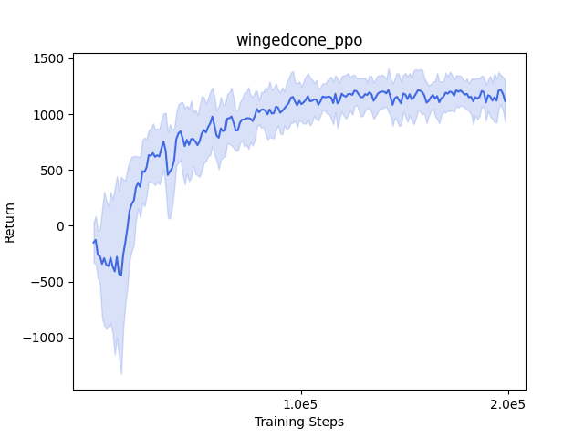
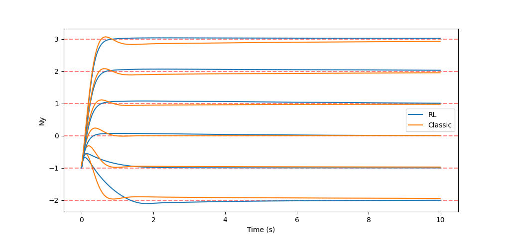

# 纵向过载控制 - 强化学习 #

本章与上一章采用相同的被控对象，保留三回路驾驶仪的内回路，使用 `PPO` 算法替代 PI 控制器。

与上一章不同，本章会以自顶向下的顺序介绍代码结构，即强化学习 $\rightarrow$ 交互环境 $\rightarrow$ 底层仿真。

使用到的代码：

- WingedCone2D - PPO： `src/simulator/CanonicalAircraftEnv/objects/WingedCone2D_RL.h`
- Python 环境： `python/aerodrome/envs/WingedCone_RL.py`
- PPO训练：`examples/AircraftControl/WingedCone_PPO.py`

## 近端策略优化 (Proximal Policy Optimization) ##

[近端策略优化（PPO）](https://arxiv.org/abs/1707.06347) 是一种强化学习策略优化算法，通过截断式策略梯度确保训练稳定性。其核心思想是在更新策略时限制新旧策略之间的差异（通过重要性采样比率裁剪），避免过大的参数更新导致性能崩溃。PPO 结合了样本高效性和训练稳定性，支持并行化采样，因此成为少有的在实物上被广泛应用的强化学习算法之一。

本项目中使用经过修改的 [CleanRL PPO](https://github.com/vwxyzjn/cleanrl/blob/master/cleanrl/ppo_continuous_action.py) 代码，构建了基本的训练工作流。由于环境接口设计仿照了 Gymnasium 的标准，因此只需要很少的改动。


```py title="WingedCone_PPO.py > 库导入"
import random 
import numpy as np
import argparse
from tqdm import tqdm
from matplotlib import pyplot as plt
from math import *
import torch
import torch.nn as nn
import torch.nn.functional as F
import torch.optim as optim
from torch.distributions.normal import Normal
from torch.optim.lr_scheduler import CosineAnnealingLR

import aerodrome
from aerodrome.simulator.CanonicalAircraftEnv.objects.WingedCone2D_RL import WingedCone2D_RL
```

这里采用一种常用的连续动作 PPO 的 actor 定义，即动作输出重参数化为动作的均值和标准差，在从其对应的正态分布中采样出动作。此处的实现与 [CleanRL PPO](https://github.com/vwxyzjn/cleanrl/blob/master/cleanrl/ppo_continuous_action.py) 略有不同，即动作采样增加了一个 evaluate 参数，作用是在部署时将正态分布的动作转换为固定动作。输出动作均值的网络 `actor_mean` 最后还加上了一层 `Tanh` 层，并在采样时限制动作范围，以满足任务需要。

```py title="WingedCone_PPO.py > 模型定义"
def layer_init(layer, std=np.sqrt(2), bias_const=0.0):
    torch.nn.init.orthogonal_(layer.weight, std)
    torch.nn.init.constant_(layer.bias, bias_const)
    return layer

class Agent(nn.Module):
    def __init__(self):
        super().__init__()
        self.critic = nn.Sequential(
            layer_init(nn.Linear(3, 256)),
            nn.ReLU(),
            layer_init(nn.Linear(256, 256)),
            nn.ReLU(),
            layer_init(nn.Linear(256, 256)),
            nn.ReLU(),
            layer_init(nn.Linear(256, 1), std=1.0),
        )
        self.actor_mean = nn.Sequential(
            layer_init(nn.Linear(3, 128)),
            nn.ReLU(),
            layer_init(nn.Linear(128, 128)),
            nn.ReLU(),
            layer_init(nn.Linear(128, 128)),
            nn.ReLU(),
            layer_init(nn.Linear(128, 1), std=0.01),
            nn.Tanh(),
        )
        self.actor_logstd = nn.Parameter(torch.zeros(1, 1))

    def get_value(self, x):
        return self.critic(x)

    def get_action_and_value(self, x, action=None, evaluate=False):
        action_mean = self.actor_mean(x)
        action_logstd = self.actor_logstd.expand_as(action_mean)
        action_std = torch.exp(action_logstd)
        if evaluate:
            probs = Normal(action_mean, action_std*1e-6) # 这里直接将 std 乘以一个小数来模拟固定动作，有点笨b但是可以保持之后的代码一致性
        else:
            probs = Normal(action_mean, action_std)
        if action is None:
            action = probs.sample()
        action = torch.clamp(action, -1.0, 1.0)
        return action, probs.log_prob(action).sum(1), probs.entropy().sum(1), self.critic(x)
    

def linear_schedule(start_e, end_e, duration, t):
    return start_e + (end_e - start_e) * min(t / duration, 1)
```

```py title="WingedCone_PPO.py > 参数解包"
def main():
    parser = argparse.ArgumentParser()
    parser.add_argument("--seed", type=int, default=0,
                        help="random seed of the experiment")
    parser.add_argument("--num_steps", type=int, default=1024,
                        help="the number of steps to run per policy rollout")
    parser.add_argument("--total_timesteps", type=int, default=300_000,
                        help="the number of iterations")
    parser.add_argument("--batch_size", type=int, default=256,
                        help="the batch size of sample from the replay memory")
    parser.add_argument("--gamma", type=float, default=0.99,
                        help="discount factor")
    parser.add_argument("--gae_lambda", type=float, default=0.95,
                        help="lambda for the general advantage estimation")
    parser.add_argument("--num_minibatches", type=int, default=1,
                        help="the number of mini-batches")
    parser.add_argument("--update_epochs", type=int, default=20,
                        help="the K epochs to update the policy")
    parser.add_argument("--norm_adv", type=bool, default=True,
                        help="Toggles advantages normalization")
    parser.add_argument("--clip_coef", type=float, default=0.2,
                        help="the surrogate clipping coefficient")
    parser.add_argument("--clip_vloss", type=bool, default=True,
                        help="Toggles whether or not to use a clipped loss for the value function")
    parser.add_argument("--ent_coef", type=float, default=0.2,
                        help="coefficient of the entropy")
    parser.add_argument("--vf_coef", type=float, default=2.,
                        help="coefficient of the value function")
    parser.add_argument("--max_grad_norm", type=float, default=0.5,
                        help="the maximum norm for the gradient clipping")
    parser.add_argument("--target_kl", type=float, default=None,
                        help="the target KL divergence threshold")
                        
    parser.add_argument("--learning_rate", type=float, default=1e-4,
                        help="learning rate")
    parser.add_argument("--device", type=str, default="cuda" if torch.cuda.is_available() else "cpu",
                        help="Device to run the experiment on")
    args = parser.parse_args()
```

这部分代码基本与 [CleanRL PPO](https://github.com/vwxyzjn/cleanrl/blob/master/cleanrl/ppo_continuous_action.py) 相同，除了加入了一些数据储存的部分、删除了原版的 `tensorboard` 部分。此外，蓝色高亮部分的代码与原版也有微妙的差别，这是因为原版代码所使用的环境和我们的环境对终止的定义有所不同。

```py title="WingedCone_PPO.py > 主函数 & 训练循环" hl_lines="77-127"
    args.batch_size = args.num_steps 
    args.minibatch_size = int(args.batch_size // args.num_minibatches)
    args.num_iterations = args.total_timesteps // args.batch_size

    random.seed(args.seed)
    np.random.seed(args.seed)
    torch.manual_seed(args.seed)
    torch.backends.cudnn.deterministic = True

    device = torch.device(args.device)
    print(f"Using device: {device}")

    env = aerodrome.make("wingedcone-v0")
    object_dict = {
        "name": "test",
        "integrator": "rk45",
        "S": 3603.0,
        "c": 80.0,
        "m": 9375.0,

        "pos": [0.0, 33528.0, 0.0],
        "vel": [4590.29, 0.0, 0.0],
        "ang_vel": [0.0, 0.0, 0.0],
        "J": [1.0, 7*10**6, 7*10**6],
        "theta": 0.00/180*pi,
        "phi": 0.0,
        "gamma": 0.0,   
        "theta_v": 0.0,
        "phi_v": 0.0,
        "gamma_v": 0.0,
        "alpha": 0.00/180*pi,
        "beta": 0.0,

        "Kiz": 0.2597,
        "Kwz": 1.6,
        "Kaz": 13/2,
        "Kpz": 0.14,
        "Kp_V": 5.0,
        "Ki_V": 1.0,
        "Kd_V": 0.3
    }

    object = WingedCone2D_RL(object_dict)
    env.add_object(object)

    agent = Agent().to(device)
    optimizer = optim.Adam(agent.parameters(), lr=args.learning_rate, eps=1e-5)
    cos_annealing_scheduler = CosineAnnealingLR(optimizer, T_max=args.num_iterations, eta_min=args.learning_rate/10)

    # Storage setup
    obs = torch.zeros((args.num_steps, 3)).to(device)
    actions = torch.zeros((args.num_steps, 1)).to(device)
    logprobs = torch.zeros((args.num_steps, 1)).to(device)
    rewards = torch.zeros((args.num_steps, 1)).to(device)
    dones = torch.zeros((args.num_steps, 1)).to(device)
    values = torch.zeros((args.num_steps, 1)).to(device)

    global_step = 0

    records = {
        "reward": np.zeros(args.num_iterations),
        "learning_rate": np.zeros(args.num_iterations),
        "value_loss": np.zeros(args.num_iterations),
        "policy_loss": np.zeros(args.num_iterations),
        "entropy": np.zeros(args.num_iterations),
    }

    for iteration in tqdm(range(1, args.num_iterations + 1)):
        env = aerodrome.make("wingedcone-v0")
        object = WingedCone2D_RL(object_dict)
        env.add_object(object)

        next_obs, info = env.reset()
        next_obs = torch.Tensor(next_obs).reshape((1, -1)).to(device)
        first_rollout = True
        rollout_return = 0.0
        for step in range(0, args.num_steps):
            global_step += 1
            obs[step] = next_obs

            # ALGO LOGIC: action logic
            with torch.no_grad():
                action, logprob, _, value = agent.get_action_and_value(next_obs)
                values[step] = value.flatten()
            actions[step] = action
            logprobs[step] = logprob

            # TRY NOT TO MODIFY: execute the game and log data.
            step_action = {
                "test": {"Nyc":1.0, "Vc":4590.29, "nn_control":action.item()},
            }
            next_obs, reward, terminations, truncations, infos = env.step(step_action)
            next_done = np.logical_or(terminations, truncations)
            rewards[step] = torch.tensor(reward).to(device).view(-1)
            next_obs, next_done = torch.Tensor(next_obs).reshape((1, -1)).to(device), torch.Tensor(next_done).reshape((1, -1)).to(device)

            dones[step] = next_done

            if first_rollout:
                rollout_return += reward
                if next_done or step == args.num_steps - 1:
                    first_rollout = False
                    rewards[step] = rollout_return

            if next_done:
                """
                这里其实是在做环境 reset ，
                但由于 python 对来自 pybind11 的 C++ 对象的序列化 (picklize) 的支持有问题，
                所以暂时没有直接实现环境的 reset，先用这种方式代替（重建一个环境）
                """
                env = aerodrome.make("wingedcone-v0")
                object = WingedCone2D_RL(object_dict)
                env.add_object(object)
                
                next_obs, info = env.reset()
                next_obs = torch.Tensor(next_obs).to(device)
            
        # bootstrap value if not done
        with torch.no_grad():
            next_value = agent.get_value(next_obs).reshape(1, -1)
            advantages = torch.zeros_like(rewards).to(device)
            lastgaelam = 0
            for t in reversed(range(args.num_steps)):
                if t == args.num_steps - 1:
                    nextnonterminal = 1.0 - next_done
                    nextvalues = next_value
                else:
                    nextnonterminal = 1.0 - dones[t]
                    nextvalues = values[t + 1]
                delta = rewards[t] + args.gamma * nextvalues * nextnonterminal - values[t]
                advantages[t] = lastgaelam = delta + args.gamma * args.gae_lambda * nextnonterminal * lastgaelam
            returns = advantages + values

        # flatten the batch
        b_obs = obs.reshape((-1, 3))
        b_logprobs = logprobs.reshape(-1)
        b_actions = actions.reshape((-1, 1))
        b_advantages = advantages.reshape(-1)
        b_returns = returns.reshape(-1)
        b_values = values.reshape(-1)

        # Optimizing the policy and value network
        b_inds = np.arange(args.batch_size)
        clipfracs = []
        for epoch in range(args.update_epochs):
            np.random.shuffle(b_inds)
            for start in range(0, args.batch_size, args.minibatch_size):
                end = start + args.minibatch_size
                mb_inds = b_inds[start:end]

                _, newlogprob, entropy, newvalue = agent.get_action_and_value(b_obs[mb_inds], b_actions[mb_inds])
                logratio = newlogprob - b_logprobs[mb_inds]
                ratio = logratio.exp()

                with torch.no_grad():
                    # calculate approx_kl http://joschu.net/blog/kl-approx.html
                    old_approx_kl = (-logratio).mean()
                    approx_kl = ((ratio - 1) - logratio).mean()
                    clipfracs += [((ratio - 1.0).abs() > args.clip_coef).float().mean().item()]

                mb_advantages = b_advantages[mb_inds]
                if args.norm_adv:
                    mb_advantages = (mb_advantages - mb_advantages.mean()) / (mb_advantages.std() + 1e-8)

                # Policy loss
                pg_loss1 = -mb_advantages * ratio
                pg_loss2 = -mb_advantages * torch.clamp(ratio, 1 - args.clip_coef, 1 + args.clip_coef)
                pg_loss = torch.max(pg_loss1, pg_loss2).mean()

                # Value loss
                newvalue = newvalue.view(-1)
                if args.clip_vloss:
                    v_loss_unclipped = (newvalue - b_returns[mb_inds]) ** 2
                    v_clipped = b_values[mb_inds] + torch.clamp(
                        newvalue - b_values[mb_inds],
                        -args.clip_coef,
                        args.clip_coef,
                    )
                    v_loss_clipped = (v_clipped - b_returns[mb_inds]) ** 2
                    v_loss_max = torch.max(v_loss_unclipped, v_loss_clipped)
                    v_loss = 0.5 * v_loss_max.mean()
                else:
                    v_loss = 0.5 * ((newvalue - b_returns[mb_inds]) ** 2).mean()

                entropy_loss = entropy.mean()
                loss = pg_loss - args.ent_coef * entropy_loss + v_loss * args.vf_coef

                optimizer.zero_grad()
                loss.backward()
                nn.utils.clip_grad_norm_(agent.parameters(), args.max_grad_norm)
                optimizer.step()

            if args.target_kl is not None and approx_kl > args.target_kl:
                break

        y_pred, y_true = b_values.cpu().numpy(), b_returns.cpu().numpy()
        var_y = np.var(y_true)
        explained_var = np.nan if var_y == 0 else 1 - np.var(y_true - y_pred) / var_y

        records["reward"][iteration - 1] = rewards.sum().item()
        records["learning_rate"][iteration - 1] = optimizer.param_groups[0]["lr"]
        records["value_loss"][iteration - 1] = v_loss.item()
        records["policy_loss"][iteration - 1] = pg_loss.item()
        records["entropy"][iteration - 1] = entropy_loss.item()

        cos_annealing_scheduler.step()

        if iteration == args.num_iterations:
            states = []
            rewards = []
            env = aerodrome.make("wingedcone-v0")
            object = WingedCone2D_RL(object_dict)
            env.add_object(object)
            next_obs, info = env.reset()
            next_obs = torch.Tensor(next_obs).reshape((1, -1)).to(device)
            step = 0
            while True:
                step += 1
                # ALGO LOGIC: action logic
                states.append(env.get_state())
                with torch.no_grad():
                    action, logprob, _, value = agent.get_action_and_value(next_obs, evaluate=True)

                # TRY NOT TO MODIFY: execute the game and log data.
                step_action = {
                    "test": {"Nyc":1.0, "Vc":4590.29, "nn_control":action.item()},
                }
                next_obs, reward, terminations, truncations, infos = env.step(step_action)
                next_done = np.logical_or(terminations, truncations)
                next_obs = torch.Tensor(next_obs).reshape((1, -1)).to(device)
                rewards.append(reward)
                if next_done or step >= 1000:
                    break
            fig, ax = plt.subplots(1, 1)
            x = np.array([states[i]["pos"][0] for i in range(len(states))])
            y = np.array([states[i]["Ny"] for i in range(len(states))])
            ax.plot(x, y)
            ax.plot(x, rewards)
            plt.show()

    fig, ax = plt.subplots(1, 1)
    ax.plot(records["reward"])
    ax.set_xlabel("Iteration")
    ax.set_ylabel("Reward")
    plt.show()

    torch.save(agent.state_dict(), "models/wingedcone_ppo.pth")

if __name__ == "__main__":
    main()
```

<figure markdown="span">
  
  <figcaption>PPO 训练曲线，性能由 5 个随机种子平均</figcaption>
</figure>

## WingedCone - Python 环境 ##

这里是 `wingedcone-v0` 环境（也就是上面的 PPO 代码中的 `env` 所属的类）的实现：

```py title="WingedCone_RL.py"
from aerodrome.core import Env
from aerodrome.registration import register
from aerodrome.simulator.Core.envs.Space3D import Space3D
from copy import deepcopy
import numpy as np

class WingedCone_RL(Env):
    def __init__(self):
        self.env = Space3D(0.01, 0.001, 5) # 初始化时创建一个 Space3D 类实例
        self.object_name = None
        self.eNy_bound = 1 # 设置用于计算奖励函数的超参数

    def add_object(self, object):
        self.env.add_object(object) # 从交互中接收一个 Aircraft3D 类，并加入到环境中
        self.object_name = object.to_dict()["name"]

    def reset(self):
        # 这个函数实际上是不可用的！因为 C++ 环境没有实现 reset 方法（因为没有合适的方法来重置一个 C++ 类）
        # 当然也没办法直接 deepcopy （不支持对 C++ 对象的序列化）
        # 所以当你要调用这个方法的时候，直接重建一个环境好了
        self.env.reset()
        state = self.env.to_dict()[self.object_name]
        obs = np.array([state["eNy"], state["i_eNy"], state["d_eNy"]])

        return obs, {}

    def step(self, action):
        state = self.env.step(action)[self.object_name] # 从交互接收动作，输入环境，获取返回状态
        obs = np.array([state["eNy"], state["i_eNy"], state["d_eNy"]]) # 观测值为状态中的 eNy，i_eNy 和 d_eNy （即PI控制器原先接收的量）

        # 奖励函数的计算（其实这一部分也可以挪到 C++ 代码中）
        # 实现上来说直接使用最简单的 -np.tanh(np.abs(state["eNy"]) / self.eNy_bound) + 1 效果好像最好
        if state["eNy"] > self.eNy_bound:
            if state["d_eNy"] < 0:
                reward = -np.tanh(np.abs(state["eNy"]) / self.eNy_bound) + 1
            else:
                reward = -np.tanh(np.abs(state["eNy"]) / self.eNy_bound)
        elif state["eNy"] < -self.eNy_bound:
            if state["d_eNy"] > 0:
                reward = -np.tanh(np.abs(state["eNy"]) / self.eNy_bound) + 1
            else:
                reward = -np.tanh(np.abs(state["eNy"]) / self.eNy_bound)
        else:
            reward = -np.tanh(np.abs(state["eNy"]) / self.eNy_bound) + 1

        if state["alpha"] > 88*np.pi/180 or state["alpha"] < -88*np.pi/180:
            terminated = np.array([1], dtype=np.bool_)
            reward -= 10.0
        else:
            terminated = np.array([0], dtype=np.bool_)
        
        return obs, reward, terminated, False, {}
    
    def get_state(self):
        state = self.env.to_dict()[self.object_name]
        return state
    
register("wingedcone-v0", "aerodrome.envs.WingedCone_RL:WingedCone_RL") # 把环境注册到 Aerodrome 模块中
```

## WingedCone2D - PPO ##

`WingedCone2D_PPO` 类也是 `WingedCone2D` 的子类，与 `WingedCone2D_Classic` 基本相同，区别仅为使用神经网络输出替换了 PI 控制器：

```cpp
// 强化学习控制
double Ny_controller(double nn_control, double wz, double dt)
{
    // 增稳回路，使用神经网络输出代替PI环节
    double eSAC = nn_control - Kaz * wz;
    i_eSAC += eSAC * dt;

    // 阻尼回路
    double eDamp = i_eSAC - Kwz * wz;

    return eDamp;
}

// 传统控制
double Ny_controller(double Nyc, double Ny, double wz, double dt)
{
    // 过载跟踪误差
    eNy = Nyc - Ny;

    // PI校正环节
    i_eNy += eNy * dt;
    p_eNy = eNy;

    double pi_eNy = Kiz * i_eNy + Kpz * p_eNy;

    // 增稳回路
    double eSAC = pi_eNy - Kaz * wz;
    i_eSAC += eSAC * dt;

    // 阻尼回路
    double eDamp = i_eSAC - Kwz * wz;

    return eDamp;
}
```

其中神经网络的输入与 PI 控制器相同，为过载偏差 `eNy` 及其微分 `d_eNy`、积分 `i_eNy`；

<details>
<summary>点击展开完整代码</summary>

```cpp title="WingedCone2D_RL.h"
#pragma once

#include <pybind11/pybind11.h>
#include <pybind11/stl.h>
#include <pybind11/eigen.h>
#include "WingedCone2D.h"
#include <vector>
#include <string>
#include <array>
#include <cmath>

namespace py = pybind11;

class WingedCone2D_RL : public WingedCone2D
{
public:
    // 俯仰角增稳过载驾驶仪控制参数
    double Kiz;   // 积分增益
    double Kwz;   // 角速度增益
    double Kaz;   // 增稳回路增益
    double Kpz;   // 比例增益

    double eNy; // 过载跟踪误差
    double eNy_prev; // 过载误差前值
    double i_eNy; // 过载积分项
    double d_eNy; // 过载比例项

    double i_eSAC; // 增稳回路积分项

    double Kp_V, Ki_V, Kd_V; // 速度控制参数

    double i_V; // 速度积分项
    double d_eV; // 速度微分项
    double eV_prev; // 速度误差前值

    double Ny; // 当前过载
    double wz; // 当前滚转角速度

    WingedCone2D_RL() {}

    WingedCone2D_RL(py::dict input_dict) : WingedCone2D(input_dict)
    {
        Kiz = input_dict["Kiz"].cast<double>();
        Kwz = input_dict["Kwz"].cast<double>();
        Kaz = input_dict["Kaz"].cast<double>();
        Kpz = input_dict["Kpz"].cast<double>();

        Kp_V = input_dict["Kp_V"].cast<double>();
        Ki_V = input_dict["Ki_V"].cast<double>();
        Kd_V = input_dict["Kd_V"].cast<double>();

        eNy = 0;
        eNy_prev = 0;
        i_eNy = 0;
        d_eNy = 0;
        i_eSAC = 0;
        i_V = 0;
        d_eV = 0;
        eV_prev = 0;

        _D();
        _L();
        _T();
        _M();

        Ny = (T * (sin(alpha) * cos(gamma_v) - cos(alpha) * sin(beta) * sin(gamma_v))
                                + L * cos(gamma_v) - N * sin(gamma_v) - m * g * cos(theta_v)) / (m * g);
        wz = ang_vel[2];
    }

    virtual void reset() override
    {
        *this = WingedCone2D_RL(initial_state);
    }

    double V_controller(double Vc, double V, double dt)
    {
        // 速度跟踪误差
        double eV = Vc - V;
        i_V += eV * dt;
        d_eV = (eV - eV_prev) / dt;
        eV_prev = eV;

        double u1a = Kp_V * eV + Ki_V * i_V + Kd_V * d_eV;
        if (u1a < 0) 
        {
            u1a = 0;
        }

        return u1a;
    }

    double Ny_controller(double nn_control, double wz, double dt)
    {
        // 增稳回路，使用神经网络输出代替PI环节
        double eSAC = nn_control - Kaz * wz;
        i_eSAC += eSAC * dt;

        // 阻尼回路
        double eDamp = i_eSAC - Kwz * wz;

        return eDamp;
    }

    virtual py::dict to_dict() override
    {
        py::dict output_dict = WingedCone2D::to_dict();
        output_dict["Ny"] = Ny;
        output_dict["eNy"] = eNy;
        output_dict["i_eNy"] = i_eNy;
        output_dict["d_eNy"] = d_eNy;

        return output_dict;
    }

    virtual py::object step(py::dict action) override
    {
        double dt = action["dt"].cast<double>();

        double Nyc = action["Nyc"].cast<double>();
        double Vc = action["Vc"].cast<double>();
        double nn_control = action["nn_control"].cast<double>();

        delta_e = Ny_controller(nn_control, wz, dt*0.1);
        delta_e = std::clamp(delta_e, -25 / 57.3, 25 / 57.3);

        double Phi = V_controller(Vc, V, dt*0.1);

        // 计算气动力
        _D();
        _L();
        _T();
        _M();

        if (integrator == "euler")
        {
            *this = *this + this->d() * dt;
        }
        else if (integrator == "midpoint")
        {
            auto temp1 = *this + this->d() * (0.5 * dt);
            auto k1 = temp1.d();
            *this = *this + k1 * dt;
        }
        else if (integrator == "rk23")
        {
            auto k1 = this->d();
            auto temp1 = *this + k1 * (0.5 * dt);
            auto k2 = temp1.d();
            auto temp2 = *this + k2 * (0.5 * dt);
            auto k3 = temp2.d();
            *this = *this + (k1 + k2 * 2 + k3) * (dt / 4);
        }
        else if (integrator == "rk45")
        {
            auto k1 = this->d();
            auto temp1 = *this + k1 * (0.5 * dt);
            auto k2 = temp1.d();
            auto temp2 = *this + k2 * (0.5 * dt);
            auto k3 = temp2.d();
            auto temp3 = *this + k3 * dt;
            auto k4 = temp3.d();
            *this = *this + (k1 + k2 * 2 + k3 * 2 + k4) * (dt / 6);
        }

        beta = cos(theta_v) * (cos(gamma) * sin(phi - phi_v) + sin(theta) * sin(gamma) * cos(phi - phi_v)) - sin(theta_v) * cos(theta) * sin(gamma);
        alpha = (cos(theta_v) * (sin(theta) * cos(gamma) * cos(phi - phi_v) - sin(gamma) * sin(phi - phi_v)) - sin(theta_v) * cos(theta) * cos(gamma)) / cos(beta);
        gamma_v = (cos(alpha) * sin(beta) * sin(theta) - sin(alpha) * sin(beta) * cos(gamma) * cos(theta) + cos(beta) * sin(gamma) * cos(theta)) / cos(theta_v);

        V = Vc;
        vel[0] = V * cos(theta_v) * cos(phi_v);
        vel[1] = V * sin(theta_v);
        vel[2] = -V * cos(theta_v) * sin(phi_v);
        h = pos[1];

        Tem = Temperature(h);
        Pres = Pressure(h);
        Rho = Density(Tem, Pres);
        a = SpeedofSound(Tem);
        g = Gravity(h);

        q = 0.5 * Rho * V * V;

        Ny = (T * (sin(alpha) * cos(gamma_v) - cos(alpha) * sin(beta) * sin(gamma_v))
                                + L * cos(gamma_v) - N * sin(gamma_v) - m * g * cos(theta_v)) / (m * g);
        wz = ang_vel[2];

        eNy = Nyc - Ny;
        i_eNy += eNy * dt;
        d_eNy = (eNy - eNy_prev) / dt;
        eNy_prev = eNy;

        return to_dict();
    }
};
```
</details>

## PPO 和传统控制的比较 ##

使用前面训练好的模型文件 `wingedcone_ppo.pth`，与传统控制方法（三回路驾驶仪）在阶跃响应下进行比较：

<details>
<summary>点击展开完整代码</summary>

```py title="StepResponse.py"
import random
import numpy as np
from matplotlib import pyplot as plt
from math import *

import torch
import torch.nn as nn
import torch.nn.functional as F
from torch.distributions.normal import Normal

import aerodrome
from aerodrome.simulator.CanonicalAircraftEnv.objects.WingedCone2D_RL import WingedCone2D_RL
from aerodrome.simulator.CanonicalAircraftEnv.objects.WingedCone2D_Classic import WingedCone2D_Classic
from aerodrome.simulator.Core.envs.Space3D import Space3D

def layer_init(layer, std=np.sqrt(2), bias_const=0.0):
    torch.nn.init.orthogonal_(layer.weight, std)
    torch.nn.init.constant_(layer.bias, bias_const)
    return layer

class Agent(nn.Module):
    def __init__(self):
        super().__init__()
        self.critic = nn.Sequential(
            layer_init(nn.Linear(3, 256)),
            nn.ReLU(),
            layer_init(nn.Linear(256, 256)),
            nn.ReLU(),
            layer_init(nn.Linear(256, 256)),
            nn.ReLU(),
            layer_init(nn.Linear(256, 1), std=1.0),
        )
        self.actor_mean = nn.Sequential(
            layer_init(nn.Linear(3, 128)),
            nn.ReLU(),
            layer_init(nn.Linear(128, 128)),
            nn.ReLU(),
            layer_init(nn.Linear(128, 128)),
            nn.ReLU(),
            layer_init(nn.Linear(128, 1), std=0.01),
            nn.Tanh(),
        )
        self.actor_logstd = nn.Parameter(torch.zeros(1, 1))

    def get_value(self, x):
        return self.critic(x)

    def get_action_and_value(self, x, action=None, evaluate=False):
        action_mean = self.actor_mean(x)
        action_logstd = self.actor_logstd.expand_as(action_mean)
        action_std = torch.exp(action_logstd)
        if evaluate:
            probs = Normal(action_mean, action_std*1e-6)
        else:
            probs = Normal(action_mean, action_std)
        if action is None:
            action = probs.sample()
        action = torch.clamp(action, -1.0, 1.0)
        return action, probs.log_prob(action).sum(1), probs.entropy().sum(1), self.critic(x)
    

def linear_schedule(start_e, end_e, duration, t):
    return start_e + (end_e - start_e) * min(t / duration, 1)

def main():
    fig, ax = plt.subplots(1, 1)
    ax.axhline(y=1.0, color='r', linestyle='--', alpha=0.5)
    ax.set_xlabel("Time (s)")
    ax.set_ylabel("Ny")

    random.seed(0)
    np.random.seed(0)
    torch.manual_seed(0)
    torch.backends.cudnn.deterministic = True

    device = torch.device("cuda" if torch.cuda.is_available() else "cpu")
    print(f"Using device: {device}")

    object_dict = {
        "name": "test",
        "integrator": "rk45",
        "S": 3603.0,
        "c": 80.0,
        "m": 9375.0,

        "pos": [0.0, 33528.0, 0.0],
        "vel": [4590.29, 0.0, 0.0],
        "ang_vel": [0.0, 0.0, 0.0],
        "J": [1.0, 7*10**6, 7*10**6],
        "theta": 0.00/180*pi,
        "phi": 0.0,
        "gamma": 0.0,   
        "theta_v": 0.0,
        "phi_v": 0.0,
        "gamma_v": 0.0,
        "alpha": 0.00/180*pi,
        "beta": 0.0,

        "Kiz": 0.2597,
        "Kwz": 1.6,
        "Kaz": 13/2,
        "Kpz": 0.14,
        "Kp_V": 5.0,
        "Ki_V": 1.0,
        "Kd_V": 0.3
    }
    
    env = aerodrome.make("wingedcone-v0")
    object = WingedCone2D_RL(object_dict)
    env.add_object(object)

    agent = Agent().to(device)
    agent.load_state_dict(torch.load("wingedcone_ppo.pth"))
    agent.eval()

    states = []
    rewards = []
    next_obs, info = env.reset()
    next_obs = torch.Tensor(next_obs).reshape((1, -1)).to(device)
    step = 0
    while True:
        step += 1
        states.append(env.get_state())
        with torch.no_grad():
            action, logprob, _, value = agent.get_action_and_value(next_obs, evaluate=True)

        step_action = {
            "test": {"Nyc":1.0, "Vc":4590.29, "nn_control":action.item()},
        }
        next_obs, reward, terminations, truncations, infos = env.step(step_action)
        next_done = np.logical_or(terminations, truncations)
        next_obs = torch.Tensor(next_obs).reshape((1, -1)).to(device)
        rewards.append(reward)
        if next_done or step >= 1000:
            break
    
    x = np.arange(1000) * 0.01
    y = np.array([states[i]["Ny"] for i in range(len(states))])
    ax.plot(x, y, label="RL")

    # Classical control
    env = Space3D(0.01, 0.001, 5)
    object = WingedCone2D_Classic(object_dict)
    env.add_object(object)

    cnt = 1000
    y = np.zeros(cnt)

    for i in range(cnt):
        action = {"test": {"Nyc":1.0, "Vc":4590.29}}
        result = env.step(action)
        y[i] = result["test"]["Ny"]

    ax.plot(x, y, label="Classic")
    ax.legend()
    plt.show()

if __name__ == "__main__":
    main()
```

</details>

<figure markdown="span">
  
  <figcaption>阶跃响应性能比较</figcaption>
</figure>